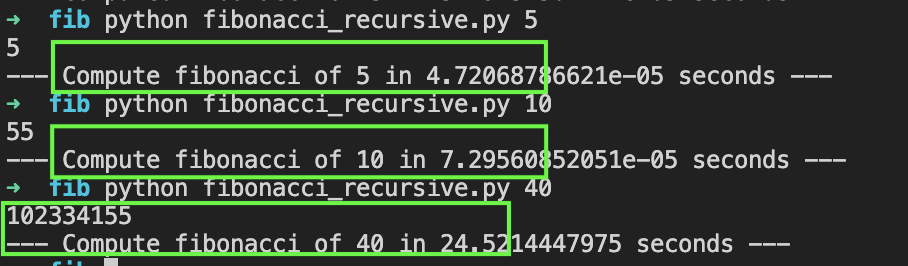
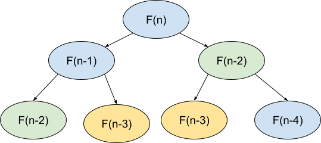
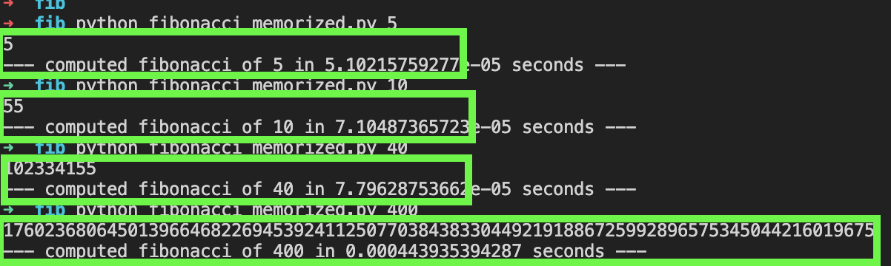

It’s been a long time that I wanted to write a few things about my passion, which is the computer programming.

So, I jump.


Then, I’d like to start this adventure with the Dynamic programming.

<h1>Dynamic programming.</h1>


Looks scary. 


The name sounds scary, but it’s a powerful tool that help us to solve complex problems.

 

There is a lot of great articles about the dynamic programming, I’ll not enter to the details on that. I just want to share my understanding. Dynamic programming is an optimization of an algorithm by using different technics. The father of Dynamic programming is [Richard Bellman](https://en.wikipedia.org/wiki/Richard_Bellman).

<h2>Memoization.</h2>


Memoization is one of the technique that we can use, it’s consist of:

 **memoize** (remember) and **re-use **solutions to** sub-problems** that help solve the problem.

To many bla bla bla, let’s use an example.

Consider the Fibonacci number.


```
def fibonacci(n):
   f = 1
   if (n <=2):
       return f
   else:
       f= fibonacci(n-1) + fibonacci(n-2)
   return f
```


This is a naive recursive function that compute the Fibonacci number of one given number.

The complexity algorithmic of this will be **Exponential** **O(2<sup>n</sup>)**

A few runs gives me the following out put:





Up to 40, my computer took time to compute the number. \
➜  fib python fibonacci_recursive.py 41

165580141

--- Compute fibonacci of 41 in 37.8068268299 seconds ---


To compute Fibonacci(n) with recurrsion we have the following graph, and we noticed that we have duplicated nodes that could be eliminated these in a cache.





By applying memoization like the following :


```
memo = {} #<-- Dictionary 
def fibonacci(n):
   if (n in memo):
       return memo[n] #<-- if the value exist in our dictionary return it
   f = 1
   if (n <=2):
       return f
   else:
       f= fibonacci(n-1) + fibonacci(n-2)
   memo[n] = f #<-- Store the value in the dictionary
   return f
```


here are the results





As we see, the results are completely different!.

<h1>Conclusion :</h1>


Dynamic programming is powerful to solve complex problems of maximization, it could be used for example to find the shortest path, Palindrome Partitioning, Maximization/minimization,...

It could be a sum of recursion and memoization.
